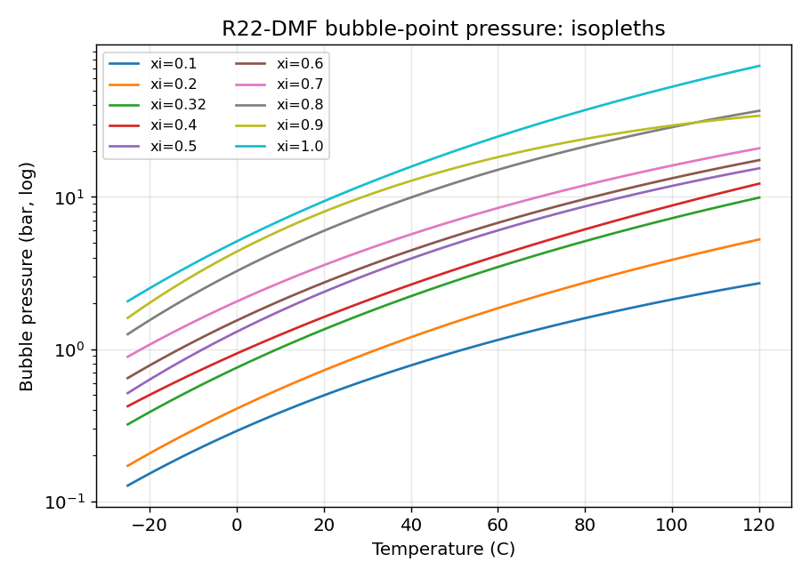
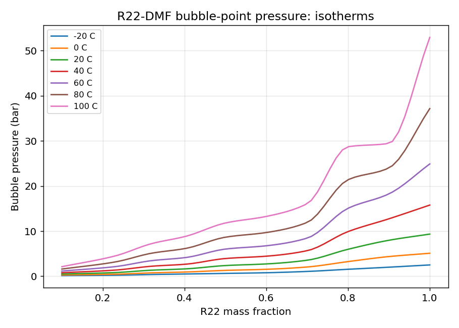
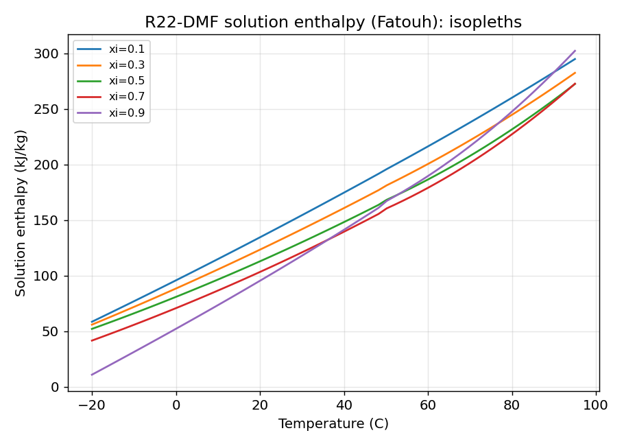
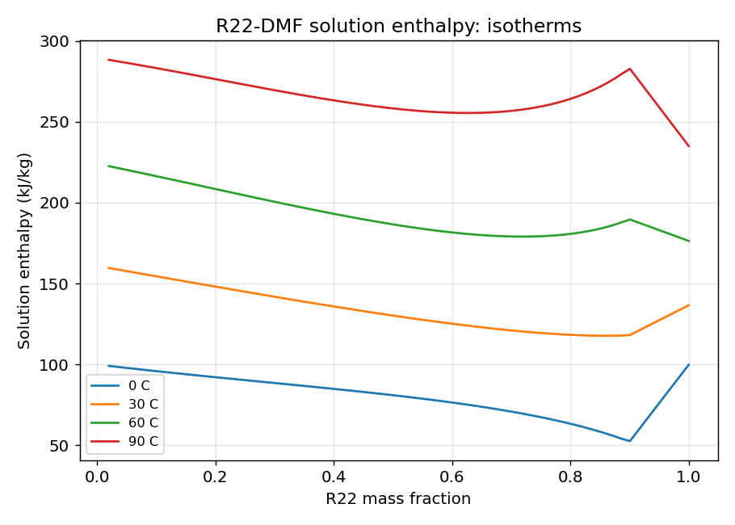

# R22–DMF 吸收工质：泡点压力与溶液焓的工程计算模型

做 R22–DMF 扩散吸收制冷（DAR）循环计算，两个物性函数绕不开：**泡点压力**和**溶液焓**。前者定系统压力、后者做能量平衡。本文给出可直接用于 Excel 的 VBA 工作表函数和 C 语言实现，全部系数公开，误差有据可查。

## 一、泡点压力 P(T, ξ)

### 数据

Agarwal 等 1982 年发表的 R22–DMF 气液平衡实验数据（经 Ardita 2008 年硕士论文附录 7 转录核对）。共 132 个有效点：温度 −25~120 °C，R22 质量分数 0.10~1.00，压力单位 bar。

转录注记：253.15 K、ξ=0.5 处原表印为 0.610 bar（已对扫描原图逐字核对，清晰无误）；个别点存在实验散布，拟合时如实保留。

### 方法

R22–DMF 是强非理想体系，直接全局多项式拟合会在边界处振荡。采用分层处理：

1. 按浓度分成 10 条等浓度线，每条拟合 Antoine 型

   ln(P/bar) = A + B/T + C·lnT，T 为 K

2. 给定温度下，先算出 10 条线上的压力，再对浓度 ξ 做**保单调 PCHIP 插值**（Fritsch–Carlson），保证 P 随 ξ 单调递增，不振荡。

10 组 Antoine 系数：

| ξ(R22) | A | B | C |
|---|---|---|---|
| 0.10000 | 30.772744 | −3182.9395 | −3.629138 |
| 0.23076 | 10.400862 | −2459.9752 | −0.388685 |
| 0.32000 | 10.271208 | −2405.5462 | −0.311415 |
| 0.40348 | −5.848160 | −1618.6504 | 2.088399 |
| 0.50000 | 39.598401 | −3709.7856 | −4.591025 |
| 0.60220 | 27.566449 | −3089.5702 | −2.819850 |
| 0.70000 | 28.096798 | −3022.7056 | −2.907606 |
| 0.80000 | 51.969188 | −4223.6822 | −6.297351 |
| 0.90000 | 99.166678 | −6197.2000 | −13.369886 |
| 1.00000 | 18.474130 | −2766.7568 | −1.197267 |

回算 132 点：平均绝对相对误差 **2.38%**，最大 9.6%。

### 函数

- `R22DMF_BubbleP(T_C, ξ)`：泡点压力，bar。T_C 为摄氏度，ξ 为 R22 质量分数。
- `R22DMF_BubbleT(P_bar, ξ)`：泡点温度，℃。二分法反算，超出范围返回 #N/A。

算例：

| 输入 | 结果 |
|---|---|
| BubbleP(30 °C, 0.5) | 3.086 bar |
| BubbleP(80 °C, 0.4) | 6.120 bar |
| BubbleP(0 °C, 0.3) | 0.690 bar |
| BubbleT(5.0 bar, 0.5) | 50.88 °C |
| BubbleT(1.0 bar, 0.3) | 12.37 °C |

## 二、溶液焓 h(T, ξ)

### 公式

采用 Fatouh 等 1993 年关联式（Ardita 论文式 2.38~2.43）：

h_s(T,ξ) = ξ·h_L,R22(T) + (1−ξ)·h_DMF(T) + h_mix(T,ξ)

其中

h_mix = [(1−ξ)·R·T²/M_mix]·(K0·Y0 + K1·Y1 + K2·Y2 + K3·Y3)

Y0 = ξ/(1−ξ)
Y1 = ξ/(1−ξ) + ln(1−ξ)
Y2 = 1/(1−ξ) − (1−ξ) + 2·ln(1−ξ)
Y3 = ξ/(1−ξ) + ξ²/2 + 2ξ + 3·ln(1−ξ)

K0 = B0/T² + 2C0/T³ − E1/T² + E2 + E3/T
K1 = B1/T² + 2C1/T³
K2 = B2/T² + 2C2/T³
K3 = 0（B3=C3=0）

常数：B=(−1817.206, −4302.679, 9877.574, 0)，C=(−135585.8, 625797.9, −1435546, 0)，
E1=−7738.2052，E2=0.05627680，E3=−34.79。
M_R22=86.47，M_DMF=73.09 g/mol，M_mix=ξ·M_R22+(1−ξ)·M_DMF，R=8.314 kJ/(kmol·K)。

纯组分焓（kJ/kg，T 为 K，参考态 273.15 K 饱和液体=100 kJ/kg）：

- R22 饱和液体：h=F0+F1·T+F2·T²。253.15~323.15 K：F=(−68.14840, 0.0631300, 0.0020200)；323.15~368.15 K：F=(1966.645, −12.09784, 0.02018352)。
- R22 饱和蒸气：253.15~323.15 K：F=(37.22971, 1.599520, −0.002260308)；323.15~368.15 K：F=(−2720.182, 18.11784, −0.02699451)。
- DMF 液体：F=(−352.2493, 1.317081, 0.001239553)。

参考点验证：h_R22液体(0 °C)=99.81，h_DMF(0 °C)=100.00 kJ/kg，与"273.15 K=100"参考态吻合。

### 两处注记

1. **论文手算例的单位问题**。论文 4.3 节手算 ξ=0.5、98.7 °C 的溶液焓为 383.75 kJ/kg。但按论文自己注明的"公式中 T 为 K"计算，结果是 **283.6 kJ/kg**；若把 98.7（°C 数值）直接代入按 K 标定的关联式，得到约 379.5 kJ/kg，与手算值接近。判定为手算时的单位误用。本文程序严格按注明的 K 执行。

2. **ξ→1 的连续性**。Fatouh 的 h_mix 在 ξ=1 处不归零（拟合数据只到 ξ=0.9），直接外推会在纯 R22 处产生跳变。程序在 0.9<ξ<1 区间做线性过渡到纯 R22 焓，保证连续。

### 函数与算例

- `R22DMF_Hsol(T_C, ξ)`：溶液焓，kJ/kg。
- `R22DMF_H_R22L / R22DMF_H_R22V / R22DMF_H_DMF`：纯组分焓。

| 输入 | 结果 |
|---|---|
| Hsol(30 °C, 0.5) | 130.26 kJ/kg |
| Hsol(80 °C, 0.4) | 237.71 kJ/kg |
| Hsol(0 °C, 0.3) | 88.57 kJ/kg |

## 三、程序

**Excel VBA**（r22_dmf.bas）：导入为标准模块后直接当工作表函数用，例如 `=R22DMF_BubbleP(40,0.5)`、`=R22DMF_Hsol(30,0.5)`。

**C 语言**（r22_dmf.c）：`gcc -O2 -Wall -o r22_dmf r22_dmf.c -lm` 零警告编译。C 版与 Python 参考实现逐点比对，最大偏差 5×10⁻⁷。

## 四、适用范围

- 泡点压力：T −25~120 °C，ξ 0.10~1.00。ξ>0.80 且 T>65 °C 时超出实测范围（R22 接近/超过临界），为外推，慎用。
- 溶液焓：T −20~95 °C，ξ 0~1（R22 纯组分关联式标定到 368 K）。
- 压力单位 bar，焓单位 kJ/kg，温度输入均为摄氏度（程序内部转 K）。

## 五、这篇文章是怎么来的

说点题外话。渔夫是个业余研究者，没有单位图书馆，做吸收式制冷纯属个人兴趣。Fatouh 等 1993 年那篇焓关联式的原文，出版商要价几十美元一篇——业余爱好者掏这钱，肉疼。

办法是 Google 搜索。Ardita 2008 年的硕士论文在网上能免费下载，一分钱没花。可论文不是英文（印尼语，"Lampiran" 就是"附录"的意思），下载了就放在硬盘里吃灰——公式看得懂，文字看不懂，数据表也不敢直接拿来用。

转机是 Muse。论文从硬盘里翻出来之后，后台的活儿都是它干的：附录 7 的 132 个数据点逐点转录成表，253.15 K 那处 0.610 bar 对着扫描原图逐字核对过；10 条等浓度线各拟一条 Antoine 式，浓度方向用 PCHIP 保单调插值，搭出泡点压力模型；Fatouh 关联式逐行翻译成 Python、C、VBA 三套实现，C 与 Python 逐点比对最大偏差 5×10⁻⁷；还顺手揪出论文手算例（98.7 °C、ξ=0.5，383.75 kJ/kg）疑似把摄氏度数值误代入了开尔文公式，按 K 算应为 283.6；四张物性图和这篇中英文文章，也都是它排的版。

渔夫负责拍板和校验，Muse 负责搬砖和算数。原材料免费，AI 工也免费——这篇文章就是这么来的。

---

*数据：Agarwal et al., 1982（经 Ardita, 2008 附录转录）；焓关联式：Fatouh et al., 1993。*
*VBA 与 C 源码随文附上，可直接用于工程计算。*

---

## 泡点–露点差曲线

- fig-glide-T-xi.png — T–ξ 图：泡点等压线（实线）与露点线（虚线）
- fig-glide-dT-xi.png — ΔT = T泡 − T露 随制冷剂质量分数变化（多条等压线）
- fig-glide-dT-P.png — ΔT 随压力变化（固定浓度）

约定：露点取纯 R22 饱和温度（DMF 视为不挥发：80°C 时 p_sat,DMF/p_sat,R22 < 0.3%）。
曲线在模型适用范围（−25~120°C、ξ 0.10~1.00）之外截断，未外推。
